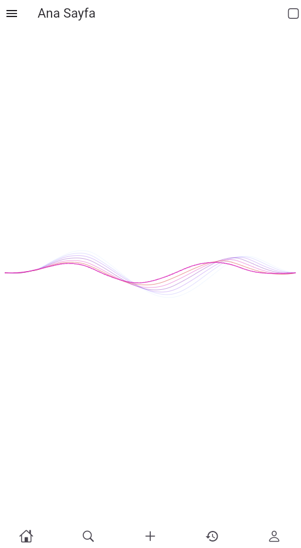
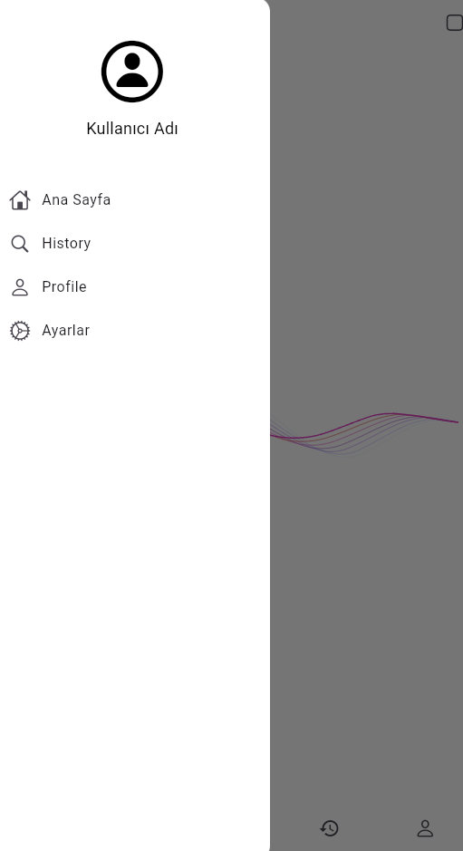
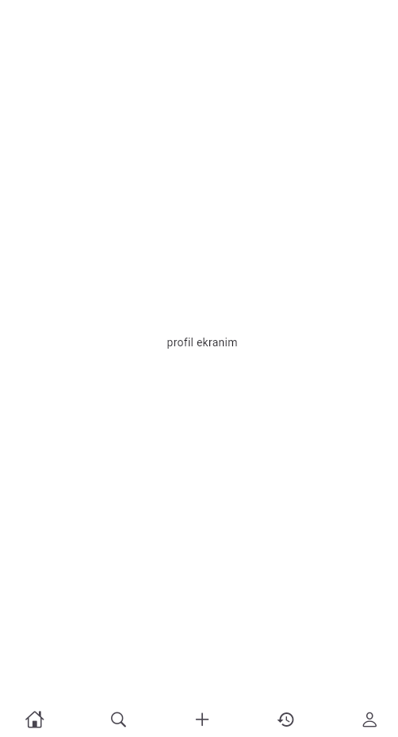

# Flutter Projesi

 

# Proje Hakkında

 Bu uygulama, kullanıcıların seyahatlerini planlamasına, kaydetmesine ve paylaşmasına olanak tanır. Kullanıcılar, ziyaret ettikleri şehirler ve ülkeler hakkında günlük tutabilir, öneriler alabilir, fotoğraflar ekleyebilir ve seyahat rotalarını harita üzerinde görselleştirebilir. Ayrıca, diğer kullanıcıların deneyimlerinden ilham alabilirler.

# Ekibimiz
+ **Danışman:** Keyvan Arasteh [GitHub]https://github.com/keyvanarasteh
+ **Takım Üyeleri:** Abdullah Şeker [GitHub]https://github.com/abdulllahseker

## Özellikler
- Seyahat grupları oluşturma ve grup üyeleriyle birlikte plan yapma
- Seyahat harcamalarını takip etme özelliği
- AR (Artırılmış Gerçeklik) ile tarihi mekanlar hakkında bilgi verme
- Offline harita desteği
- Gezi sonrası kullanıcıya özel video özetleri oluşturma

## Kullanılan Teknolojiler
- Flutter
- Dart

## Başlangıç

### Gereksinimler
- Flutter SDK (sürüm 10.0.19045.5131)
- Dart SDK 

### Kurulum Adımları 
 1. Projeyi bilgisayarınıza indirin: 
     ```bash
     git clone [https://github.com/abdulllahseker/travel_diary1]
  2. Proje klasörüne gidin:
     ```bash
     cd [travel_diary1]
  3. Gerekli paketleri yükleyin:
     ```bash
     flutter pub get
  4. Uygulamayı başlatın:
     ```bash
     flutter run

## Proje yapısı

lib/
|-- modeller/ # Veri modelleri
|-- ekranlar/ # Uygulama ekranları
|-- widgets/ #Tekrar kullanılabilir arayüz öğeleri
|-- servisler/ # API servisleri
|-- yardımcılar/ # Yardımcı fonksiyonlar


## Ekran Görüntüleri







## Projeye Katkı Sağlama

1. Projeyi forklayın
2. Yeni bir dal oluşturun ( ``git checkout -b ozellik/YeniOzellik`` )
3. Değişikliklerinizi kaydedin (` git commit -m 'Yeni özellik eklendi' `)
4. Dalınıza gönderin ( `git push origin ozellik/YeniOzellik`)
5. Pull request oluşturun

## Lisans
[lisans türü] kapsamında lisanslanmıştır. Daha fazla bilgi için `LİCENSE`   dosyasını inceleyebilirsiniz.

## İletişim
Proje Bağlantısı: [https://github.com/abdulllahseker/travel_diary1]
İstinye Üniversitesi: https://www.istinye.edu.tr/

## Teşekkürler
- İstinye Üniversitesi'ne destekleri için teşekkür ederiz.